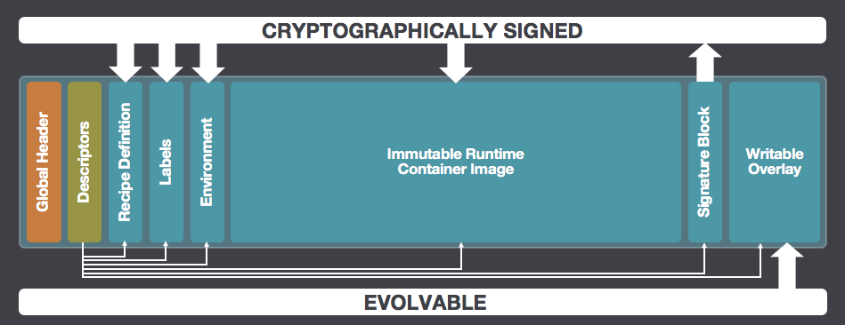

# The Singularity Image Format (SIF)

[](https://pkg.go.dev/github.com/apptainer/sif/v2)
[](https://circleci.com/gh/hpcng/workflows/sif)
[](https://codecov.io/gh/hpcng/sif)
[](https://goreportcard.com/report/github.com/apptainer/sif)
[](https://magefile.org)

This module contains an open source implementation of the
Singularity Image Format (SIF) that makes it easy to create complete and
encapsulated container environments stored in a single file.



Unless otherwise noted, the SIF source files are distributed under the
BSD-style license found in the [LICENSE.md](LICENSE.md) file.

## Download and Install From Source

To get the sif package to use directly from your programs:

```sh
go get -d github.com/apptainer/sif/v2
```

To get the siftool CLI program installed to `$(go env GOPATH)/bin` to
manipulate SIF container files:

```sh
git clone https://github.com/apptainer/sif
cd sif
go run mage.go install
```

## Go Version Compatibility

This module aims to maintain support for the two most recent stable versions
of Go. This corresponds to the Go
[Release Maintenance Policy](https://github.com/golang/go/wiki/Go-Release-Cycle#release-maintenance)
and [Security Policy](https://golang.org/security), ensuring critical bug
fixes and security patches are available for all supported language versions.

## Contributing

SIF and [Apptainer](https://github.com/apptainer/apptainer) are the work of many
contributors. We appreciate your help!

To contribute, please read the contribution guidelines found in the
[CONTRIBUTING.md](CONTRIBUTING.md) file.
